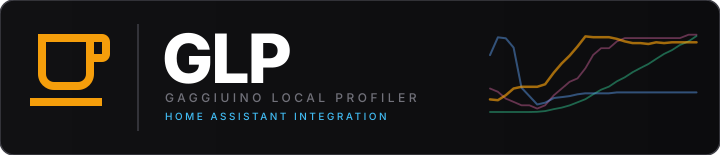

<p align="center">
  
</p>

<p align="center">
  <a href="https://github.com/mxkissnr/glp-integration/releases">
    
  </a>
  <a href="https://github.com/custom-components/hacs">
    
  </a>
  
  
  
  
</p>

<p align="center">
  Exposes <a href="https://github.com/mxkissnr/gaggiuino-local-profiler">Gaggiuino Local Profiler</a> as native Home Assistant entities —<br/>
  machine status, shot data, live brewing state and machine sensors, all without cloud.
</p>

---

## ⚡ Quick Install

<a href="https://my.home-assistant.io/redirect/hacs_repository/?owner=mxkissnr&repository=glp-integration&category=integration">
  
</a>

---

## ✨ Features

| | Feature | Description |
|---|---|---|
| ☕ | **Brewing Sensor** | Binary sensor updated every 2 seconds — perfect as automation trigger |
| 📊 | **Shot Sensors** | Profile, rating, duration, pressure, yield, ratio, dose, coffee, grinder, shots today and more |
| 🌡️ | **Machine Sensors** | Live pressure, temperature, water level, weight, uptime, active profile — updated every 5 s |
| 🔧 | **Maintenance Sensors** | One sensor per task (descaling, backflush, group head, gaskets, water filter) with progress value |
| ⏱️ | **Preheat Sensors** | Preheat ready binary sensor + elapsed / remaining time sensors |
| 🎛️ | **Profile Selector** | `select` entity to switch the active brew profile from any HA dashboard or automation |
| 🔔 | **Shot Event** | Fires `gaggiuino_profiler_shot_completed` with full shot data after every pull |
| ⚙️ | **Configurable** | URL and poll interval adjustable any time via *Settings → Integration → Configure* |
| 🔍 | **Diagnostics** | HA diagnostics export for easy bug reports |

> **Replaces ALERTua/hass-gaggiuino** — as of v1.9.0 this integration provides all machine sensors (temperature, pressure, water level, weight, profile, uptime) natively. You no longer need a second integration.

---

## 🚀 Installation

### HACS (recommended)

1. Click the button above — or: HACS → Integrations → ⋮ → **Custom repositories**
2. Add `https://github.com/mxkissnr/glp-integration` as **Integration**
3. Search for *Gaggiuino Local Profiler* and install
4. Restart Home Assistant

### Manual

1. Copy `custom_components/gaggiuino_profiler/` into your `config/custom_components/` directory
2. Restart Home Assistant

---

## ⚙️ Setup

1. **Settings → Devices & Services → Add Integration**
2. Search for *Gaggiuino Local Profiler*
3. Enter the URL of your GLP add-on:
   ```
   http://localhost:8099
   ```
   > **Use `localhost`, not `homeassistant.local`.** mDNS resolution of `homeassistant.local` can fail intermittently from within the HA core container on HA OS, causing all sensors to go unavailable. `localhost:8099` is always reachable because HA OS runs the core container in host-network mode.

   The integration validates the connection immediately.

### Options

**Settings → Devices & Services → Gaggiuino Local Profiler → Configure**

| Option | Default | Description |
|---|---|---|
| URL | *(entered URL)* | URL of the GLP add-on |
| Poll interval | `60` | Update interval in seconds (10–300) |

---

## 📋 Entities

### Shot & Status Sensors *(60 s poll, configurable)*

| Entity | Description | Unit |
|---|---|---|
| Machine Status | `online` / `error` | — |
| Shot Count | Total number of stored shots | shots |
| Shots Today | Number of shots pulled today | shots |
| Last Shot Profile | Extraction profile name | — |
| Last Shot Rating | Star rating (1–5 ★) | — |
| Last Shot Date | Timestamp of the last shot | — |
| Last Shot Duration | Shot duration | s |
| Last Shot Avg Pressure | Average extraction pressure | bar |
| Last Shot Yield | Output weight | g |
| Last Shot Brew Ratio | Yield ÷ dose | — |
| Last Shot Dose | Input dose weight | g |
| Last Shot Coffee | Coffee annotation | — |
| Last Shot Grinder | Grinder annotation | — |
| Last Sync | Timestamp of last sync | — |
| Machine Hostname | Gaggiuino controller hostname | — |
| Machine Temperature | Current boiler temperature | °C |
| Machine Target Temperature | Target boiler temperature | °C |
| Preheat Elapsed | Time elapsed since machine switched on | s |
| Preheat Remaining | Estimated time until machine is ready | s |

### Machine Live Sensors *(5 s poll via machine coordinator)*

| Entity | Description | Unit |
|---|---|---|
| Machine Live Pressure | Current extraction pressure | bar |
| Machine Water Level | Water reservoir fill level | % |
| Machine Live Weight | Current weight on scale | g |
| Machine Uptime | Controller uptime | s |
| Machine Active Profile | Currently active brew profile name | — |

### Maintenance Sensors *(60 s poll)*

| Entity | Description |
|---|---|
| Maintenance Descaling | Progress toward next descaling |
| Maintenance Backflush | Progress toward next backflush |
| Maintenance Group Head | Progress toward next group head service |
| Maintenance Gaskets | Progress toward next gasket replacement |
| Maintenance Water Filter | Progress toward next filter replacement |

### Binary Sensors

| Entity | Description | Update rate |
|---|---|---|
| Brewing | `on` during an active pull; attributes: `datapoints`, `profile_name`, `seq` | every 2 s |
| Preheat Ready | `on` when machine has reached stable brewing temperature | 60 s |
| Steam Switch | `on` when steam mode is active | 5 s |

### Select

| Entity | Description |
|---|---|
| Profile | Active brew profile — read/write; options list updated every 60 s |

---

## 🔔 Event: `gaggiuino_profiler_shot_completed`

Fired automatically after every completed pull. Contains all relevant shot data:

```yaml
event_type: gaggiuino_profiler_shot_completed
data:
  shot_id: 54
  profile: "Adaptive"
  duration_s: 28.4
  yield_g: 42.1
  dose_g: 18.0
  ratio: 2.34
  avg_pressure: 8.72
  score: 87
  coffee: "Ethiopia Yirgacheffe"
  grinder: "DF64"
```

### Automation examples

**Notification after each shot:**
```yaml
automation:
  trigger:
    platform: event
    event_type: gaggiuino_profiler_shot_completed
  action:
    service: notify.mobile_app
    data:
      title: "☕ Shot done"
      message: >
        {{ trigger.event.data.profile }} –
        {{ trigger.event.data.duration_s }}s,
        ratio 1:{{ trigger.event.data.ratio }}
```

**Dim lights when brewing ends:**
```yaml
automation:
  trigger:
    platform: state
    entity_id: binary_sensor.gaggiuino_local_profiler_brewing
    from: "on"
    to: "off"
  action:
    service: light.turn_on
    target:
      entity_id: light.kitchen
    data:
      brightness_pct: 30
```

---

## 🏗️ Architecture

```
Home Assistant
├── GlpDataCoordinator  (60 s, configurable)
│   ├── GET /api/status    → machine status, shotCount, lastSync, preheat
│   └── GET /shots.json    → shot data, annotations, datapoints
│
├── GlpLiveCoordinator  (2 s)
│   └── GET /api/live/data → isLive (brewing state + live datapoints)
│
├── GlpMachineCoordinator  (5 s)
│   └── GET /api/machine/status → pressure, temperature, water level,
│                                  weight, uptime, active profile, steam switch
│
└── Event Bus
    └── gaggiuino_profiler_shot_completed  (on new shot_id)
```

---

## 🔍 Diagnostics

**Settings → Devices & Services → Gaggiuino Local Profiler → Device → Download Diagnostics**

The diagnostics file contains current coordinator data (no sensitive information) and makes it easy to file an issue.

---

<p align="center">
  <a href="https://github.com/mxkissnr/gaggiuino-local-profiler/wiki">📖 Documentation (Wiki)</a> ·
  <a href="CHANGELOG.md">📋 Changelog</a> ·
  <a href="https://github.com/mxkissnr/gaggiuino-local-profiler">🔧 GLP Add-on</a> ·
  <a href="https://github.com/mxkissnr/glp-integration/issues">🐛 Issues</a>
</p>

---

## License

GPL-3.0 © 2024–2026 mxkissnr — free to use, fork and modify; any derivative work must remain open source under the same license. Commercial use is not permitted.

## Acknowledgements

Inspired by [BeanConqueror](https://github.com/graphefruit/beanconqueror) by graphefruit — a fantastic open-source coffee tracking app that pioneered many of the ideas around shot logging and coffee library management that influenced this project.

Built on top of the [Gaggiuino](https://gaggiuino.github.io/) project. The machine sensor design was inspired by the original [Gaggiuino Home Assistant Integration](https://github.com/ALERTua/hass-gaggiuino) by ALERTua — thank you for pioneering the HA connectivity concepts that made this possible.

---

<p align="center">
  <sub>Built with <a href="https://claude.ai/code">Claude Code</a> by Anthropic</sub>
</p>
